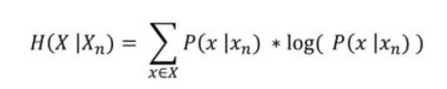

# Soynlp
* 한국어 분석을 위한 pure python code이며, 문장을 단어열로 분해 혹은 품사 판별을 할 수 있는 비지도학습을 기반으로 한다.
---
### Setup
- pip install soynlp
---

### Module in soynlp
##### 1. Nounextractor
##### 2. Wordextractor
##### 3. Tokenizer
##### 4. Part of Speech Tagger (POS)
##### 5. Vectorizer
##### 6. Normalizer
##### 7. Point-wise Mutual Information (PMI)

---

### 1. Nounextractor
- 여러개의 문서로부터 학습한 통계 정보를 이용하여 작동. 
- 하나의 문장 혹은 이질적 집단의 문서들 보단 영화 댓글과 같은 집합의 문서만 모아서 학습하는것이 좋다.
- 명사 추출 모듈
- nounextractor_test.py

	#### nounextractor_test.py 참고.
	- DoublespaceLineCorpus : 문장 구분이 두개의 공백(space)로 구성되어 double space를 기준으로 문장 자르는 	모듈
		- Parameter : 
			- iter_sent : True 인 경우 for loop를 돌때와 corpus의 길이를 계산할 때, 문장 단위로 계산.

	- LRNounExtractor_v2 : v1 보다 명사 추출의 정확성이 높으며 합성명사 인식이 가능하고, 명사의 빈도 계산이 가능.
		> 한국어의 어절은 L + [R] 구조로 L은 의미를 지니는 단어 '명사, 동사, 형용사, 부사'등을 의미하며 R은 '조사'를 		의미한다.

	- Parameters:
		- max_left_length : default=10, L의 최대 길이
		- max_right_length : default=9, R의 최대 길이
		- lrgraph : default=None, L과 R이 포함된 문장(dict 구조 {}).
		- verbose : default= True, True인 경우 진행상황을 볼수 있다.
		- min_num_of_features : default=1, feature의 최소 수.
		- max_frequency_when_noun_is_eojeol : default=30, 명사가 어절일때의 최대 빈도.
		- eojeol_counter_filtering_checkpoint : default=500000
		- extract_compound : default=True, 복합명사 추출.
		- extract_pos_feature = default=False, tag 추출.
		- extract_determiner = default=False, 구분자 추출.
		- ensure_nomalized = default=False, 정규화
		- logpath = default=None, log파일 경로

	- function :
	 	1. .train() : 학습을 할때 사용.
	 	2. .extract() : 명사 점수 계산.
	 	3. .train_extract() : 학습과 명사 점수 계산을 동시 진행하며, 주로 해당 함수 사용.
		4. .compounds_components : 복합명사의 components가 저장되어 있으며, tuple로 구성되어 있다.
		> ex : ('호매실지구', ('호매실', '지구'))
		5. .decompose_compound() : 입력된 문자가 복합명사일 경우 이를 단일명사의 tuple로 분해.
		> ex : noun_extractor.decompose_compound('잠수함발사탄도미사일') -> ('잠수함', '발사', 		'탄도미사일')
		6. .lrgraph.get_r() or .lrgraph.get_l(): srt과 함께 나오는 L or R과 count 정보.
			- topk=-1 로 설정하면 모든 L 또는 R set이 출력된다.
		> ex : noun_extractor.lrgraph.get_r('아이오아이')) ->
		> [('', 123), ('의', 47), ('는', 40), ('와', 18), ('가', 18), ('에', 7), ('에게', 6), 		('까지', 2), ('랑', 2), ('부터', 1)]

### 2. Wordextractor
- 통계를 이용하여 단어의 경계 점수를 학습시키므로, 각 단어의 품사를 판단할 수 없다.
- 통계에 기반하여 단어를 찾아내는 unsupervised learning 방법 중 3가지의 방법을 이용한다.
- wordextractor_text.py

- Branching Entropy(BE) : 단어 내부에서는 불확실성과 엔트로피가 줄어들고 단어 경계에서는 증가하는 현상을 모델링 	한 것으로 엔트로피가 높을수록 형태소일 확률이 크므로 BE가 높은 문자열을 단어 취급한다.(주로 중국어 자연어 처리에 사용)

- Accessor Variety : branching entropy의 추상적인 값 , conditional random field의 potential function을 구성하는데 편리하다.

	> Potential function은 categorical value를 포함하여 sequence로 입력된 다양한 형태의 값을 벡터로 변환하며, Boolean필터 처럼 작동하고,

	> 임의의 형태의 데이터라 하더라도 Boolean filter를 거쳐 high dimensional sparse Boolean vector 로 표현한다.

	> Conditional Random Field 는 특정 상황일 때 특정 label의 확률을 학습하는 모델이며, logistic regression 을 이용하는 sequential labeling 용 알고리즘이다.

- Cohesion Score : 단어를 구성하는 글자들이 얼마나 함께 자주 등장하는지의 정보로 단어의 경계를 판단하는 방법 (interior boundary scoring)

	* Parameters:
		- max_left_length : default=10, L의 최대 길이
		- max_right_length : default=6, R의 최대 길이
		- min_frequency : default=5, 최소 빈도수
		- verbose_points : default=100000
		- min_cohesion_forward : default=0.1,  L의 cohesion score 최소 확률
		- min_cohesion_forward : default=0.0, R의 cohesion score 최소 확률
		- max_droprate_cohesion : default=0.95, cohesion score 최대 확률
		- max_droprate_leftside_frequency : default=0.95, L 빈도수의 최대 확률
		- min_left_branching_entropy : default=0.0, L의 branching entropy 최소 확률
		- min_right_branching_entropy: default=0.0, R의 branching entropy 최소 확률
		- min_left_accessor_variety : default=0, L의 accessor variety 최소 확률
		- min_right_accessor_variety : default=0, R의 accessor variety 최소 확률
		- remove_subowrds : default=True

	* Function:
		- .train() : substrings의 빈도수 카운팅
		- .extract() : init에 들어가는 파라미터를 기준으로 단어 선택
		- .all_cohesion_scores() : cohesion score 점수 산출
		- .all_branching_entropy() : branching entropy 점수 산출
		- .all_accessor_variety() : accessor variety 점수 산출
		- .word_scores() : 조건에 맞는 점수 산출.

	* 단어 점수로 주로 사용되는 방법 : cohesion_forward * right_branching_entropy 
		- 의미 : (1) 주어진 글자가 유기적으로 연결되어 함께 자주 나타나고, (2) 그 단어의 우측에 다양한 조사, 어미, 혹은 다른 단어가 등장하여 단어 우측의 branching entropy가 높다는 의미. 

### 3. Tokenizer
- NounExtractor 또는 WordExtractor 로부터 단어 점수를 학습하고, 이를 이용하여 단어의 경계를 따라 문장을 단어열로 분해하는 모듈. (모든 토크나이징 모듈의 input은 dict {word:score} 구조)
- tokenizer_test.py

	- Function:
		- LTokenizer : L parts의 단어 점수를 입력하여, 단어열로 분해한다. 단, 문장의 띄어쓰기가 잘 되어 있는 텍스트여야 한다.

			* 만약 WordExtractor로 점수 산출한 경우 3가지의 score중 하나를 택하여 분해할 수 있다.
			* parameter : 
				* tolerance : default=0, 한 어절에서 subwords의 점수의 차이가 그 어절의 점수 최대값과 tolerance 이하로 난다면, 문장 길이가 가장 긴 어절을 선택한다.
				> Q) scores = {'데이':0.5, '데이터':0.5, '데이터마이닝':0.5, '공부':0.5, '공부중':0.45}, sentence = '데이터마이닝을 공부중이다.' 

				> A1) tolerance=0.0 일때 tokenize = ['데이터마이닝', '을', '공부', '중이다']

				> A2) tolerance=0.1 일땐 tokenize = ['데이터마이닝', '을', '공부중', '이다']

		- MaxScoreTokenizer : 띄어쓰기가 제대로 지켜지지 않은 데이터임에도 문장 분해가 가능하며, LTokenizer와 마찬가지로 단어 점수를 이용.
			- 이미 알려진 단어 사전이 있는경우 해당 단어들에 더 큰 점수를 부여하면 그 단어는 하나의 단어로 잘려진다.

		- RegexTokenizer : 정규식을 바탕으로 문장을 단어열로 분해하며 띄어쓰기가 제대로 되어있지 않은 경우엔 사용이 불가능하다.

				> Q1)  이렇게연속된문장은잘리지않습니다만
				> A1) ['이렇게연속된문장은잘리지않습니다만']

				> Q2) 숫자123이영어abc에섞여있으면ㅋㅋ잘리겠죠
				> A2) ['숫자', '123', '이영어', 'abc', '에섞여있으면', 'ㅋㅋ', '잘리겠죠']

				> Q3) 띄어쓰기가 포함되어있으면 이정보는10점!꼭띄워야죠
				> A3) ['띄어쓰기가', '포함되어있으면', '이정보는', '10', '점', '!', '꼭띄워야죠']

### 4. Part of Speech Tagger
- 사전을 기반으로 단어의 품사를 판별하는 기능을 한다.
- 사전은 사용자가 만들고 해당 사전으로 사용이 가능하며, 형식은 dict 이다.
	> pos_dict = {
    'Adverb': {'너무', '매우'},
    'Noun': {'너무너무너무', '아이오아이', '아이', '노래', '오', '이', '고양'}}
- pos_test.py

	* pos_Module
		- Function in 'Dictionary' :
			- get_pos() : 주어진 단어 word 에 대하여 등록되어 있는 모든 품사를 list 형식으로 return
			- word_is_tag : 주어진 단어 word 가 품사 tag 인지 확인
			- max_length : 현재 사전에 등록된 단어 중에서 가장 긴 단어의 길이
			- add_words : 사전에 품사가 tag인 단어들을 추가하는 함수. (words는 하나의 str 또는 여러개의 단어로 이루어진 collection of str 이며, 파라미터 force=True로 설정하면 현재 등록되지 않은 품사일지라도 사전에 추가 가능)
 			- remove_words : 품사 tag에 해당하는 words를 사전에서 제거 (단, 사전에 등록된 word 순서에 맞게 제거), 만약 tag만 입력할 경우 해당 tag를 모두 제거
		- LRTemplateMatcher : 생성한 Dictionary를 이용하여 단어열 후보 생성
			- .generate() : input=str or str list, LR 이라는 namedtuple로 반환.
				> return = namedtuple('LR', 'l l_tag r r_tag b m e') 

				> LR : tuple name

				> l, l_tag = 단어 (명사/형용사/동사/부사/감탄사), tag명

				> r, r_tag = 단어 또는 공백 (조사), tag명

				> b, m, e = 시작 글자 index, 단어 길이, 마지막 글자 index

		- LREvaluator() 와 LRTemplateMatcher()를 이용하여 Tagger 생성.
		- UnknowLRPostprocessor()를 사용하여 사전 매칭이 되지 않는 단어들도 출력되게 합니다.(tag = None)

		- debug=True 옵션을 통해 SimpleTagger().tag() 를 실행할 때, 문장내의 단어열 뿐 아니라 디버깅용 LR 후보 리스트들이 출력.

		- LREvaluator()의 파라미터 preference를 통해 특정 품사의 단어에 대해 점수의 가중치를 더해줄 수 있다.

### 5. Vectorizer
- 토크나이저를 학습하거나, 학습된 토크나이저를 이용하여 문서를 sparse matrix (행렬의 대부분의 값이 0인 행렬) 로 만든다.
	> corpus -> term frequency matrix로 변환.

	> scipy.sparse.csr.csr_matrix  사용.

- vectorizer_test.py

	- Parameters :
		- tokenizer : default=lambda x:x.split(), 학습된 tokenizer
		- min_tf, max_tf : TF(단어빈도) 단어 빈도수의 최소값과 최대값
		- min_df, max_df : default= (min_df=0, max_df=1.0), 특정 단어를 포함한 문서의 비율 
			> min_df=0.02인 경우 100개의 문서에서 1번만 등장한 단어는 제외됨)

		- stopwords : default=None, 불용어사전 (dict {})
		- lowercase : default=True, True인 경우 영어의 경우 모든 글자를 소문자로 변환
		- verbose : default=True, True 인 경우 현재의 상황을 print
		- vocabulary_ :  {str:int} 형식으로 각 단어가 어떤 idx 에 해당하는지를 나타내는 dict 가 저장
		> 주로 min_tf, max_tf, min_df, max_df를 조절한다.

	- Function :
		- fit : 학습데이터에서 변환을 위한 기반 설정
		- transform : fit에서 기반 설정한 폼으로 데이터 변환.
		- fit_transform :  기반 설정과 폼 변환 모두 실행
		- fit_to_file , to_file: 데이터가 크거나 바로 sparse matrix를 이용하지 않을 경우 메모리에 올리지 않고 파일로 저장
		- encode_a_doc_to_bow : 학습되어 잇는 단어를 기반으로 문장을 list of int로 encoding
		- decode_from_bow : list of int -> list of str 로 decoding
		- encode_a_doc_to_list : dict 형식의 bag of words 로 encoding
		- decode_from_list : dict 형식의 bag of words 를 decoding

### 6. Normalizer
- 대화 데이터 또는 댓글 데이터 등에 등장하는 반복되는 이모티콘 정리 및 한글 혹은 텍스트만 남기기 위한 함수 제공
- normalizer_test.py

	- Function:
		- emoticon_normalize : 반복되는 글자들 사이에 완전한글이 있는경우 글자를 줄이고 , 자음/모음 이모티콘을 분해
			- num_repeats : default=2, 반복되는 글자의 축약횟수 조절
		- repeat_normalize : 반복되는 글자 축약 (emoticon_normalize와 파라미터 동일)
		- only_hangle : 한글과 숫자만 남기며, 이외의 글자는 공백 처리되고 연속된 공백은 하나만 남겨진다
		- only_text : 영어, 한글, 숫자, 문법 기호(!?.,"')만 남기고 나머지는 공백처리

### 7. Point-wise Mutual Information (PMI)
- (word, contexts) 이나 (input, outputs) 와의 상관성을 측정하는 방법
- 서로 상관이 없는 경우 0이며, 그 값이 클수록 positive correlated 이다.
- 음의 값을 갖는 경우 0으로 치환.
- 주로 연관 분석에 사용된다.

- pmi_test.py

	* sent_to_word_contexts_matrix : (word, context words) matrix 를 만들 수 있다. (in vectorizer)

	x : scipy.sparse.csr_matrix 이며 (n_vocabs, n_vocabs) 크기이고, idx2vocab는 x의 각 row, column 에 해당 하는 단어가 포함된 list of str = Co-occurrence matrix

	windows 단어를 context로 인식하며, min_tf 이상의 빈도수로 등장한 단어에 대해서만 계산

	dynamic_weight : context 길이에 반비례하여 weighting 하며,
	if window = 3 , 1,2,3 칸 떨어진 단어의 co-occurrence 는 1, 2/3, 1/3으로 계산된다.

	- Function:
		- pmi_func : x의 (rows, columns)에 대한 pmi를 계산 (row=x, column=y)

			min_pmi : default=0, min_pmi 이상 값만 저장.
			alpha : default=0, smoothing factor. pmi(x,y; alpha) = p_xy /(p_x * (p_y + alpha))
			beta : default=0, Smoothing factor. pmi(x,y) = log ( Pxy / (Px x Py^beta) )
			verbose : default=True, True 인 경우 현재의 상황을 print

#### 참고 자료.
- https://github.com/lovit/soynlp

			

#### 참고 라이브러리
- soyspacing : 띄어쓰기 오류 교정 라이브러리. (https://github.com/lovit/soyspacing)
- sejong_corpus_cleaner : 형태소/품사 형태로 정제된 학습용 데이터 만드는 함수 제공 (https://github.com/lovit/sejong_corpus_cleaner)

